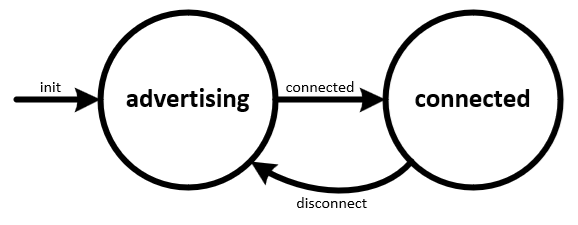

# Simple Advertiser w/State Machine
This starter project demonstrates use of the `StateMachine` class from the `state_machine` module included in `/starter_projects/lib`. This script is designed for use with a module or DVK with Bluetooth Low Energy support.

This script creates a `BLEAdvertiserWithConnect` class that extends the `StateMachine` class and defines the states in the state machine in its class methods. Events are defined for initialization, connection and disconnection. The App class instantiates the state machine which in turn starts a CustomAdvertiser to broadcast BLE ads with a set of data that can be used by the corresponding `ble_scanner_with_connect.py` starter project to filter ads.

The application starts in `advertising_state` broadcasting connectable BLE advertisements. Once a connection from a BLE central device has been established, a `connected_event` is triggered and the state changes to `connected_state`. Upon a `disconnect_event`, the application returns to `advertising_state` starting the cycle over. The state diagram is shown below:

In a real-world application, additional logic may be added to handle defining GATT services or responding to read/write requests from the central device. This starter project may be extended to add such functionality by adding states and events to the existing script.
