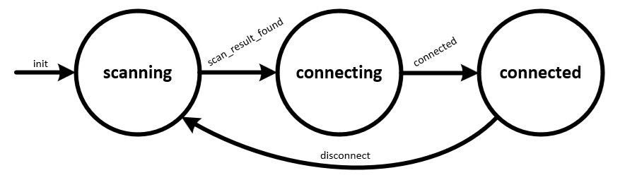

# Simple Scanner w/State Machine
This starter project demonstrates use of the `StateMachine` class from the `state_machine` module included in `/starter_projects/lib`. This script is designed for use with a module or DVK with Bluetooth Low Energy support.

This script creates a `BLEScannerWithConnect` class that extends the `StateMachine` class and defines the states in the state machine in its class methods. Events are defined for initialization, scan result found, connection and disconnection. The App class instantiates the state machine which in turn starts a CustomScanner to filter and scan for BLE ads based on criteria defined in the script. This script is designed to work with the corresponding `ble_advertiser_with_connect.py` starter project.

The application starts in `scanning_state` scanning for connectable BLE advertisements that match the configured filter. Once a scan result is found matching the filter, a connection to the peripheral is established by triggering a `scan_result_found_event`. A `connected_event` is triggered once the connection is established and the state changes to `connected_state`. Upon a `disconnect_event`, the application returns to `scanning_state` starting the cycle over. The state diagram is shown below:

In a real-world application, additional logic may be added to handle GATT service discovery, reading/writing to characteristics or otherwise interacting with the peer device This starter project may be extended to add such functionality by adding states and events to the existing script.
