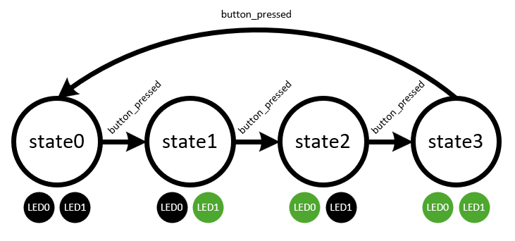

# State Machine - Transition with Button
This starter project demonstrates use of the `StateMachine` class from the `state_machine` module included in `/starter_projects/lib`. This script is designed for use with any Ezurio development board implementing `BUTTON1` and 2 LEDs `LED0` and `LED1` (e.g., the Veda SL917 SoC explorer board).

This script creates a `StateTransition` class that extends the `StateMachine` class and defines the states in the state machine in its class methods `state0`, `state1`, `state2` and `state3`. A single "event" is defined named `button_pressed`. In each state, when the `button_pressed` event occurs, the state handler function transitions state to the next in the list as seen in the diagram below:

A button event handler is implemented on `BUTTON0` that triggers the `button_pressed` event in the state machine each time the button is pressed.

`LED0` and `LED` are turned on/off in a different pattern for each state to help indicate the current state.

In a real-world application, many additional events can be defined to trigger different behavior in each state. Additionally, many more states can exist to handle each operating mode of the application.
