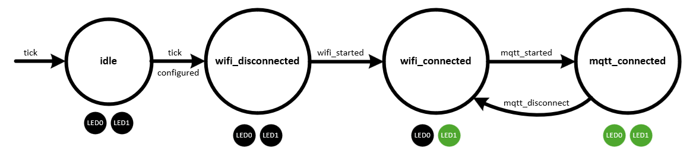

# Wi-Fi based BLE to MQTT Gateway
This starter project demonstrates a basic BLE to MQTT gateway, capable of filtering BLE ads, extracting data from the ads and publishing them to a remote MQTT broker. The application is implemented with a state-machine using a configuration file to set parameters for the Wi-Fi network to join and the MQTT broker to connect with. This project has several dependencies available in `/starter_projects/lib` (see `project.yml` for details) and is designed for use with the Veda SL917 SoC Explorer board.

This script creates a `WifiBleToMqtt` class that extends the `StateMachine` class and defines the states in the state machine in its class methods `idle_state`, `wifi_disconnected_state`, `wifi_connected_state` and `mqtt_connected_state`. Events are defined in the constructor (`tick_event`, `wifi_started_event`, `mqtt_started_event`, `mqtt_disconnect_event`) and trigger transitions between each state as the application runs. The application awaits required configuration to be set, then joins the configured Wi-Fi network. Once joined to the Wi-Fi network, the MQTT client attempts to connect to the remote MQTT broker. Once the MQTT client is connected, a BLE scan is configured to filter for ads reported by a Sentrius BT510 device running the `canvas_bt510_beacon` demo application. Data is captured from each detected BT510 sensor and periodically published to a configured MQTT topic. The state machine can be seen below:

LED0 is used to indicate the status of the MQTT connection. When off, the MQTT client is disconnected. When on, the MQTT client is connected.
LED1 is used to indicate the status of the Wi-Fi network connection. When off, the Wi-Fi network is disconnected. When on, the Wi-Fi network is connected.
When a BLE scan result is received, LED0 will flash momentarily.
When an MQTT publish occurs, LED1 will flash momentarily.

## Configuration
### Setting Configuration Parameters from the REPL
To run this application, several required configuration parameters must be set. To set a configuration parameter from the REPL console, type:

`app.config.set('<parameter_key>', '<parameter_value>')`

The following parameters are required before the application can join a Wi-Fi network and enable the MQTT client connection:
* `wifi_ssid` (string): The Wi-Fi SSID of the network to join.
* `wifi_passphrase` (string): The Wi-Fi passphrase of the network to join.
* `mqtt_client_id` (string): The client ID used for the MQTT connection.
* `mqtt_hostname` (string): The hostname of the MQTT broker.
* `mqtt_port` (number): The port to use for the MQTT client connection. 1883 is typical for non-TLS MQTT connections, 8883 is typical for MQTT over TLS connections.
* `mqtt_user` (string): The user name used for the MQTT connection (required if not using TLS).
* `mqtt_password` (string): The password used for the MQTT connection (required if not using TLS).
* `mqtt_keepalive` (number): Interval (in seconds) of the MQTT keepalive messaging (i.e., MQTT ping message) required by the MQTT broker.
* `mqtt_publish_topic` (string): The topic prefix data will be published to. The application will automatically add a suffix to the topic string indicating the device ID of the BT510 sensor. For example, setting this to 'sensors/veda_sensors' will result in data from a sensor with device id of '01001122334455' being published to the topic 'sensors/veda_sensors/01001122334455'.

### Saving the Configuration File
Once all configuration parameters have been set using the `app.config.set()` function, the configuration must be saved to a file. To save the configuration from the REPL console, type:

`app.config.save()`

This will save the values to the filesystem. After a RESET of the device, the configuration file will be used by the application to join the configured Wi-Fi network and start the MQTT client.

## Configuring the MQTT Client for TLS Connections (optional)
If desired, the MQTT client can be configured with a CA certificate, client key and client certificate to use TLS to connect with a remote MQTT broker. This requires 3 files be copied to the filesystem of the Canvas device, one for each of the credentials used by the MQTT client. Configuration parameters indicate the names of each of the files the application will load the credentials from.

The following parameters specify the filenames for each required credential to enable MQTT over TLS:
* `mqtt_ca_cert_file`: Specifies the filename for the CA certificate file on the filesystem. This file will be used by the MQTT client to validate the server certificate during the TLS handshake.
* `mqtt_client_cert_file`: Specifies the filename for the client certificate file on the filesystem. This is the public certificate this device uses during the TLS handshake. This certificate must be signed by a certificate authority (CA) registered with the MQTT broker.
* `mqtt_client_key_file`: Specifies the filename for the client key file on the filesystem. This is the private key corresponding to the device's client certificate.

Once these 3 parameters are configured and saved, copy files (named to match the configuration parameters) for each certificate and key to the filesystem. These files will be used by the application (after a RESET) to initiate a TLS-based connection with the MQTT broker.
